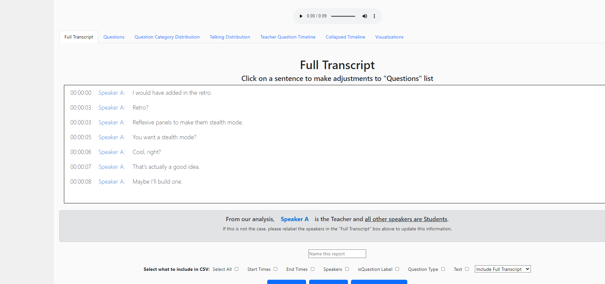

<a name="readme-top"></a>

<br />
<div align="center">
  <a href="https://github.com/TCU-Instructional-AI/classifAI">
    
  </a>

<h2 align="center">ClassifAI</h2>


  <p align="center">
    ClassifAI enhances educational content by transcribing video and audio into text for user modification and categorizes questions, offering engagement insights and user-friendly access.<br>
    <br />
    <a href="https://classifai.tcu.edu/"><strong>Visit the Portal »</strong></a>
    <br />
    <br />
    <a href="https://tcu-classifai.github.io/classifAI/">Documentation</a>
    ·
    <a href="https://github.com/TCU-ClassifAI/classifAI/issues">Report Bug</a>
    ·
    <a href="https://github.com/TCU-ClassifAI/classifAI/issues">Request Feature</a>
    ·
    <a href="http://riogrande.cs.tcu.edu/2324InstructionalEffectiveness">Project Information</a>
    
  </p>
</div>

[![GitHub contributors][contributors-shield]][contributors-url]
[![Forks][forks-shield]][forks-url]
[![Stargazers][stars-shield]][stars-url]
[![Issues][issues-shield]][issues-url]

***


<!-- TABLE OF CONTENTS -->
<details>
  <summary>Table of Contents</summary>
  <ol>
    <li>
      <a href="#about-the-project">About The Project</a>
      <ul>
        <li><a href="#built-with">Built With</a></li>
      </ul>
    </li>
    <li>
      <a href="#getting-started">Getting Started</a>
      <ul>
        <li><a href="#prerequisites">Prerequisites</a></li>
        <li><a href="#installation">Installation</a></li>
      </ul>
    </li>
    <li><a href="#usage">Usage</a></li>
    <li><a href="#roadmap">Roadmap</a></li>
    <li><a href="#contributing">Contributing</a></li>
    <li><a href="#contact">Contact</a></li>
  </ol>
</details>


<!-- ABOUT THE PROJECT -->
## About The Project



ClassifAI is a web application that enhances educational content by transcribing video and audio into text for user modification and categorizes questions, offering engagement insights and user-friendly access.


### Built With

* [React JS](https://react.dev/) (Frontend)
* [D3](https://d3js.org/) + [VisX](https://airbnb.io/visx) (Visualization)
* [Express JS](https://expressjs.com/) (Backend)
* MongoDB (Database)
* Docker (Deployment)
* AWS Cognito (Deployment)

This connects to the [ClassifAI Engine](https://github.com/TCU-Instructional-AI/classifAI-engine) that handles the transcription and classification of the videos.


<!-- GETTING STARTED -->
## Getting Started

To get a local copy of this site up and running follow these simple steps.

More detailed instructions can be found in the [documentation](https://tcu-classifai.github.io/classifAI/).

### Prerequisites

* [Node.js](https://nodejs.org/en/download/)
* [MongoDB](https://www.mongodb.com/try/download/community)
* [Docker](https://www.docker.com/products/docker-desktop)

### Installation

1. Clone the repo
```sh
git clone https://github.com/TCU-ClassifAI/classifAI
```
For Frontend:

2. Install NPM packages
```sh
cd frontend
npm install
```
3. Run the frontend development server
```sh
npm run dev
```

4. (Optional) Build the project for deployment
```sh
npm run build
```
For Backend:

2. Install NPM packages
```sh
cd backend
npm install
```
3. Run the backend
```sh
npm run dev
```
For Database:

1. Install MongoDB
2. Run MongoDB
```sh
mongod
```

<!-- ROADMAP -->
## Roadmap

- Add more features to the dashboard
  - [x] Word Clouds
  - [x] Automatic Question Categorization via NLP
  - [x] Question Categorization via User Input
  - [ ] Identify student questions that are not answered in the video
  - [ ] Identify students that are struggling with the content
  - [ ] Give a summary of the video
  - [ ] Give a summary of the questions
- Update the User Experience
  - [ ] Add Google Authentication for login
  - [ ] Streamline the process of uploading videos
  - [ ] Add a way to upload videos from YouTube
  - [ ] Add a way to upload videos from Zoom


See the [open issues](https://github.com/TCU-ClassifAI/classifAI/issues) for a full list of proposed features (and known issues).


<!-- CONTRIBUTING -->
## Contributing

Contributions are what make the open source community such an amazing place to learn, inspire, and create. Any contributions you make are **greatly appreciated**.

If you have a suggestion that would make this better, please fork the repo and create a pull request. You can also simply open an issue with the tag "enhancement".
Don't forget to give the project a star! Thanks again!

1. Fork the Project
2. Create your Feature Branch (`git checkout -b feature/AmazingFeature`)
3. Commit your Changes (`git commit -m 'Add some AmazingFeature'`)
4. Push to the Branch (`git push origin feature/AmazingFeature`)
5. Open a Pull Request

<p align="right">(<a href="#readme-top">back to top</a>)</p>


<!-- CONTACT -->
## Contact

[Learn About the Team](http://riogrande.cs.tcu.edu/2324InstructionalEffectiveness)

Project Link: [https://github.com/TCU-ClassifAI/classifAI](https://github.com/TCU-ClassifAI/classifAI/)

More info about AI work being done at TCU: [https://ai.tcu.edu/](https://ai.tcu.edu/)

Check out the  [documentation](https://tcu-classifai.github.io/classifAI/) for more information about the project!


<p align="right">(<a href="#readme-top">back to top</a>)</p>


<!-- MARKDOWN LINKS & IMAGES -->
<!-- https://www.markdownguide.org/basic-syntax/#reference-style-links -->
[contributors-shield]: https://img.shields.io/github/contributors/TCU-Instructional-AI/classifAI.svg?style=for-the-badge
[contributors-url]: https://github.com/TCU-Instructional-AI/classifAI/graphs/contributors
[forks-shield]: https://img.shields.io/github/forks/TCU-Instructional-AI/classifAI.svg?style=for-the-badge
[forks-url]: https://github.com/TCU-Instructional-AI/classifAI/network/members
[stars-shield]: https://img.shields.io/github/stars/TCU-Instructional-AI/classifAI.svg?style=for-the-badge
[stars-url]: https://github.com/TCU-Instructional-AI/classifAI/stargazers
[issues-shield]: https://img.shields.io/github/issues/TCU-Instructional-AI/classifAI.svg?style=for-the-badge
[issues-url]: https://github.com/TCU-Instructional-AI/classifAI/issues
[license-shield]: https://img.shields.io/github/license/TCU-Instructional-AI/classifAI.svg?style=for-the-badge
[license-url]: https://github.com/TCU-Instructional-AI/classifAI/blob/master/LICENSE.txt
[linkedin-shield]: https://img.shields.io/badge/-LinkedIn-black.svg?style=for-the-badge&logo=linkedin&colorB=555
[linkedin-url]: https://linkedin.com/in/linkedin_username
[product-screenshot]: images/screenshot.png
[Next.js]: https://img.shields.io/badge/next.js-000000?style=for-the-badge&logo=nextdotjs&logoColor=white
[Next-url]: https://nextjs.org/
[React.js]: https://img.shields.io/badge/React-20232A?style=for-the-badge&logo=react&logoColor=61DAFB
[React-url]: https://reactjs.org/
[Vue.js]: https://img.shields.io/badge/Vue.js-35495E?style=for-the-badge&logo=vuedotjs&logoColor=4FC08D
[Vue-url]: https://vuejs.org/
[Angular.io]: https://img.shields.io/badge/Angular-DD0031?style=for-the-badge&logo=angular&logoColor=white
[Angular-url]: https://angular.io/
[Svelte.dev]: https://img.shields.io/badge/Svelte-4A4A55?style=for-the-badge&logo=svelte&logoColor=FF3E00
[Svelte-url]: https://svelte.dev/
[Laravel.com]: https://img.shields.io/badge/Laravel-FF2D20?style=for-the-badge&logo=laravel&logoColor=white
[Laravel-url]: https://laravel.com
[Bootstrap.com]: https://img.shields.io/badge/Bootstrap-563D7C?style=for-the-badge&logo=bootstrap&logoColor=white
[Bootstrap-url]: https://getbootstrap.com
[JQuery.com]: https://img.shields.io/badge/jQuery-0769AD?style=for-the-badge&logo=jquery&logoColor=white
[JQuery-url]: https://jquery.com 
